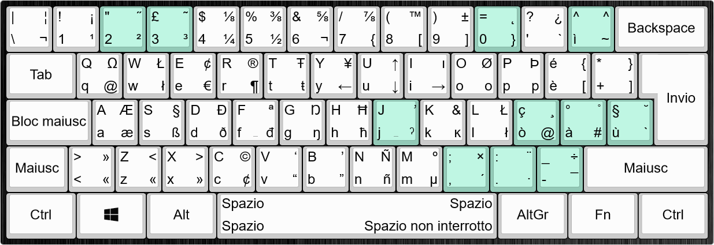

# Layout tastiera italiano di linux per windows

Ogni tasto riporta quattro caratteri, per ottenere quello desiderato procedere come segue:

* Il carettere in basso a sinistra è prodotto senza utilizzare modificatori es. <kbd>A</kbd>
* Il carattere in alto a sinistra è prodotto tenendo premuto il **Maiusc** es. <kbd>Maiusc</kbd> + <kbd>A</kbd>
* Il carattere in basso a destra è prodotto tenendo premuto il pulsante **AltGr** es. <kbd>AltGr</kbd> + <kbd>A</kbd>
* Il carattere in alto a destra è prodotto tenedo premuti i pulsanti **Maiusc** e **AltGr** es. <kbd>Maiusc</kbd> + <kbd>AltGr</kbd> + <kbd>A</kbd>

I tasti verdi contengono simboli chiamati _dead keys_ ed abilitano l'utilizzo di particolari **modificatori**. Eseguire la combinazione del simbolo non mostrerà nessun carattere a video, il successivo carattere digitato, se compatibile, verrà modificato opportunamente

### Lista di dead keys

* **doppio accento acuto** <kbd>Shift</kbd> + <kbd>AltGr</kbd> + <kbd>2</kbd> es. ̋ő, Ő, ű, Ű
* **tilde** <kbd>Shift</kbd> + <kbd>AltGr</kbd> + <kbd>3</kbd> es. ã, Ã, ñ, Ñ
* **ogonek** <kbd>Shift</kbd> + <kbd>AltGr</kbd> + <kbd>0</kbd> es. ą, Ą, ų, Ų
* **accento circonflesso** <kbd>Shift</kbd> + <kbd>AltGr</kbd> + <kbd>ì</kbd> es. â, Â, ô, Ô
* **hook** <kbd>AltGr</kbd> + <kbd>j</kbd> es. ả, Ả, ỏ, Ỏ
* **horn** <kbd>Shift</kbd> + <kbd>AltGr</kbd> + <kbd>j</kbd> es. ơ, Ơ, ư, Ư
* **cedilla** <kbd>Shift</kbd> + <kbd>AltGr</kbd> + <kbd>ò</kbd> es. ç, Ç
* **ring** <kbd>Shift</kbd> + <kbd>AltGr</kbd> + <kbd>à</kbd> es. å, Å
* **accento grave** <kbd>AltGr</kbd> + <kbd>ù</kbd> es. È, Ù
* **breve** <kbd>Shift</kbd> + <kbd>AltGr</kbd> + <kbd>ù</kbd> es. eg. ă, Ă, ŏ, Ŏ
* **dieresi** <kbd>Shift</kbd> + <kbd>AltGr</kbd> + <kbd>.</kbd> es. ä, Ä, ẅ, Ẅ
* **macron** <kbd>AltGr</kbd> + <kbd>-</kbd> es. ā, Ā, ē, Ē

### Bloc maiusc e lettere accentate comuni

Attivando <kbd>Bloc maiusc</kbd> si potranno ottenere i corrispondenti caratteri maiuscoli per le seguenti lettere accentate à, è, ì, ò, ù. Usando la combinazione <kbd>Maiusc</kbd> + <kbd>è</kbd> si potrà ottenere il carattere É.

## Installazione

Per installare il layout è sufficiente eseguire il file setup.exe presente nell'archivio disponibile nella [release](https://github.com/turcs85/kbd-ita-win/releases)

## Modifica

Scaricando il tool [MKSC](https://www.microsoft.com/en-us/download/details.aspx?id=102134) è possibile importare il file sorgente [ItaLinux.klc](src/ItaLinux.klc) e creare il proprio layout